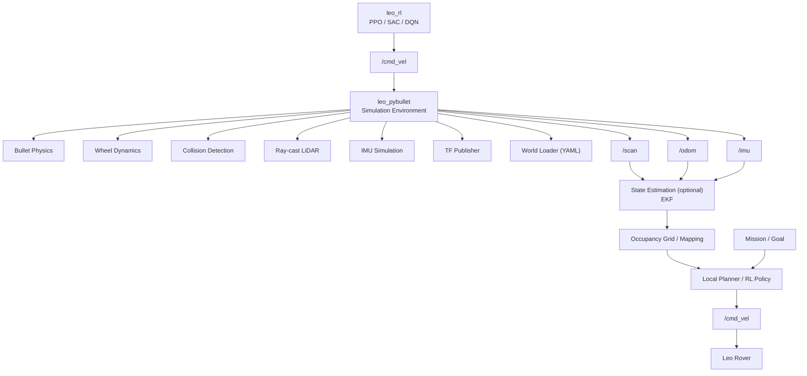

# System Architecture

This document describes the current and planned architecture of the Leo Rover simulation project.

## Overview

The project follows a modular ROS 2 architecture. The simulator is responsible for generating realistic robot dynamics and sensor data, while higher-level algorithms (e.g., reinforcement learning or obstacle avoidance) interact with the simulator only through standard ROS interfaces.

---

## Architecture Diagram

---

# Current Packages

| Package | Description |
|----------|-------------|
| **leo_description** | Robot URDF, meshes and robot model |
| **leo_gz_worlds** | Gazebo worlds used for baseline simulation |
| **leo_pybullet** | Bullet physics simulator with custom ROS 2 interfaces |
| **leo_random_walk_cpp** | Simple controller used for simulator testing |

---

# Current ROS Topics

| Topic | Message Type | Publisher |
|--------|--------------|-----------|
| `/cmd_vel` | `geometry_msgs/Twist` | Controller |
| `/scan` | `sensor_msgs/LaserScan` | PyBullet simulator |
| `/odom` | `nav_msgs/Odometry` | PyBullet simulator |
| `/imu` *(planned)* | `sensor_msgs/Imu` | PyBullet simulator |
| `/tf` | `tf2_msgs/TFMessage` | PyBullet simulator |

---

# Current Simulator Components

The `leo_pybullet` package currently implements:

- Bullet rigid-body physics
- Differential drive wheel dynamics
- Collision detection
- Ray-casting 2D LiDAR
- Odometry publishing
- TF publishing
- RViz visualization
- YAML-based world loading

---

# Planned Extensions

The following components are planned for future development:

- IMU simulation
- Wheel encoder simulation
- Occupancy grid generation
- Reinforcement learning environment
- Local planner
- Real robot interface
- Sim-to-real transfer

---

# Data Flow

1. A controller (or RL agent) publishes velocity commands on `/cmd_vel`.
2. The Bullet simulator updates the robot dynamics.
3. The simulator publishes:
   - `/scan`
   - `/odom`
   - `/imu` (planned)
   - `/tf`
4. A state estimation node (optional) fuses the sensor data.
5. The mapping module generates an occupancy grid.
6. A planner or RL policy computes the next velocity command.
7. The new `/cmd_vel` command is sent back to the simulator (or to the real robot).

This architecture allows the same high-level software to be used in simulation and on the physical robot with minimal modifications.
